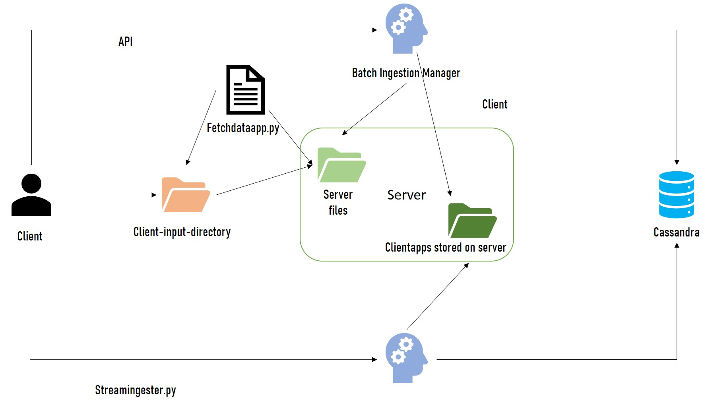

# DESIGN


## Part1: Ingestion with Batch

#### 1.1  
I was asked to define a set of constraints for files which should be ingested. So, I implemented these constraints into a simple JSON configuration file. 

Each user of **mysimplebdp** has a configuration file with the following parameters: 
* userID
* extension
* maxSize
* maxFiles

An example of JSON configuration file with these constraints should be:

``` 
  [
   {
    "userID": 1,
    "extension": ".csv",
    "maxSize": 10,
    "maxFiles": 8
    "clientapp": "clientingestapp"
   }
  ]
  
``` 
- userID: it is a kind of univoque value
- extension: it is a list of allowed file format, in my bdp only .csv file are accepted
- maxSize: max size for each file expressed in MB
- maxFiles: number of files accepted in the client-input-directory
- clientapp: app used to run ingestion 


#### 1.2  
According to the requirements, the main process to be followed by each user is:


 1.  Put the files to be ingested in the client-input-directory.
 2. Run `python mysimbdp-fetchdata.py <userID> <clientapp>`
 3. the program will obtain user ingestion constraints from api `requests.get(url+"/users/account/"+userID)`and it will check the validity:
 4. A list of "valid files" is send to the server through api 
 5. Implementation of the "sending" api


#### 1.3

Here, I was asked to implement a batchingestmanager which is able to invoke the ingestion process built inside the clientapp. To do this, I used watchdog python tool: it monitors changes in the server side directory. 

You can find batchingestmanager function inside api_app.py


#### 3.4 
Here a quick test of the ingestion. 

| user   | account  |  dataset |    
|------------|----------|------------|
| user1  | {"1": {"userID": "1", "extension": ".csv", "maxSize": 8, "maxFiles": 50, "clientapp": "locationapp"}}| locationindoor.csv duplicated by 50 |   
| user2  |  {"2": {"userID": "2", "extension": ".csv", "maxSize": 8, "maxFiles": 50, "clientapp": "googleapp"}}| googleplaystore.csv duplicated by 50| 


As written above, once the batchingestmanager has observed a change, it calls the right clientapp to perform a batch ingestion. 

Results :

|user|data size|time for each row|
|---|---|---|
|user1|156.6 MB| 0.001025 seconds|
|user2|141.9 MB| 0.001463 seconds|

 

#### 3.5.
I was asked to provide a "logging capturing" for the ingestion process. The following image is an example of log produced by the ingestion of a file:

I decided to store a log for:
- creation of keyspace
- creation of a new table
- data dimension
- begin/end ingestion


## Part2: Near-realtime ingestion

#### 2.1 
At this stage the request was to introduce a simple message structure that all consumers have to use. 

I decided for a very basic structure: 
```
{'userID': userID,
'clientapp': clientapp,
'data': {all columns present in the dataset}
} 
```
In order for our message manager to handle the message. Client should give the userID and specified which userApp should be invoke while ingesting the data given. Below are a sample for my client message:
1085,20180315,17:59:26,livingroom
part_id,ts_date,ts_time,room
```
{	'userID': 1,
	'clientapp': 'locationapp',
	'data':	{'userID': '',
				 'clientapp': 'locationapp',
				 'data': {'part_id': 1085,
						  'ts_date': 20180315,
						  'ts_time': '17:59:26',
						  'room': 'livingroom'
						  }
			 }
```
#### 2.2 
As suggested in the assignment guideline, I have choosen Apache Kafka as message broker of the mysimdbp. I implemented the streamingestmanager which calls the the different "streaming ingestion apps" according to the message received by the broker. 

1. Run streaming ingest manager `python streamingestmanager.py`
2. When any data ingest by the client, the streaming ingest managaer would handle the message and ingest them into cassandra


#### 2.3 
I created two test case in which both *locationstreamapp* app and *googlestreamapp* take each row of the .csv dataset as message and then ingest them.  Below are the list of my test environment and data. 

| user   |  data | clientapp | 
|------------|---|---|
| user1  | **locationindoor.csv** rows streaming  |  locationstreamapp |   
| user2  | **googleplaystore.csv** rows streaming | googlestreamapp  |  


#### 2.4

I decided for this report in JSON format (because of its semplicity):
```
{
	'userID':userID,
	'clientapp': clientapp,
	'ingestion_time': time,
	'amount_ingested': number_messages,
	'size_ingested': whole_size,
}`
```


#### 2.5. 
As asked in this point, I have create a report management function.
In the streamingestmanager I added a topic called "report". Then all the clientapps have a thread with a while cycle (every 15 seconds) which returns the report message to the report topic

A very common approach (the one I used) is to generate a kafka producer (in the clientapp)  and a kafka consumer (in the streamingestmanager).

**Constraints model**

```
{
	'userID':userID,
	'clientapp':client,
	'maxIngestionTime': time,
}
```


I decided to insert **maxIngestionTime**  because if the ingestion time is slower than the maxIngestTime it means that the number of clientapp instances is not enough to manage the quantity of messages. 


## Part3: Integration and Extension

#### 3.1
A possible integrated architecture for both batch and near-realtime ingestion could be the following one: 


#### 3.2
If a file for batch ingestion will be too big to be ingested using the batch ingestion, I could "split" this file into n number of files. 
First of all I will get the size of the file, if it is too big I will compute a right number of "sub-files" in which split the biggest one. Finally post the files. 


#### 3.3

I think that know the user's code should be a problem when there are some sensitive data / algorithms behind the code. Otherwise, if there are some agreements between the users and "me" as provider, it could be safer for both entities. 


#### 3.4
In order to ingest only data with a pre-defined quality of data condition, I can define a kind of "quality pipe-line" in which there are different steps in order to keep the quality level at the requested one. 

The steps should be:
* Definition of the quality concept;
* Continuous monitoring of the incoming data 
* Cleanse of "poor of quality" data


#### 3.5

To allow a consumer to use multiple clientbatchingestapp and clientstreamingestapp, I could add the functionality to have multiple app for each user profile in order to support a multiple exchange of data. 
